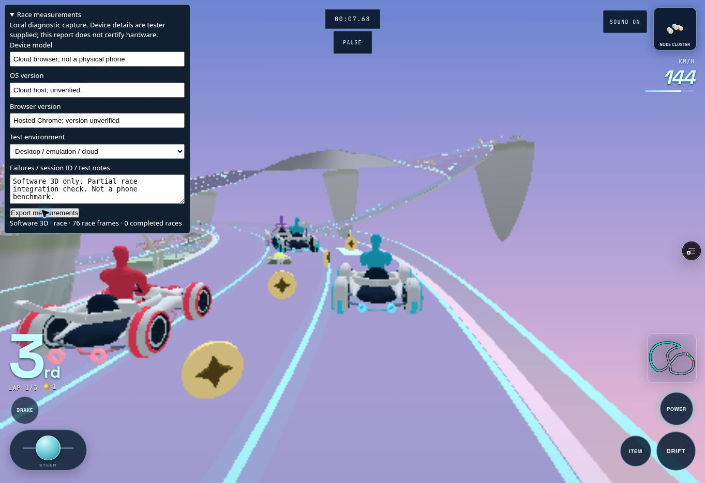

# Hosted follow-up validation

Runtime commit `29ab3801e0a8b2cbfed882aef61ea15edf24ee89` deployed as Vercel
`dpl_2Gk2uhdHzNGWkL62GQAT2RGuBYHx`, READY. Build logs show all geometry/runtime checks
and the actual twelve-GLB suite passing; deployment completed after the verification build.
The subsequent diagnostic metadata change excludes arbitrary URL query parameters from
exports, so temporary deployment-access parameters cannot enter measurement files.

GitHub Actions run `34064717109`, job `101571350131`, did not start any test steps.
Its check annotation reads: “The job was not started because your account is locked due
to a billing issue.” This is separate from the successful Vercel build and local verify.

The hosted preview loaded all twelve models and opened Settings/Character Select. Touch
controls enabled and Start Race launched the full twelve-driver Cherry grid. The available
browser remains Software 3D with approximately one-second rAF delivery. This is a launch
and recorder integration check, not a full race or physical performance acceptance test.

No WebGL shader/camera/reference comparison or physical phone capture is attached. The
missing access and failed Blender startup are recorded explicitly in the linked protocols.

The export completed and the downloaded JSON was inspected (the browser notification
wait timed out despite the file arriving). It contains 32 partial-race samples, p50
1,016.4 ms / p95 1,016.5 ms, mean 1.03 FPS and 3,115.7 ms initial readiness. This is
software-renderer/cloud-scheduler behavior, not physical hardware or a completed race.
See [raw measurements](software-smoke-measurements.json); only the URL query metadata
was removed to exclude temporary preview-access parameters. No timing values were changed.

Blender startup was subsequently recovered from a complete retained installation.
The img2threejs supported-resumption blocker and lack of physical/WebGL access remain.
