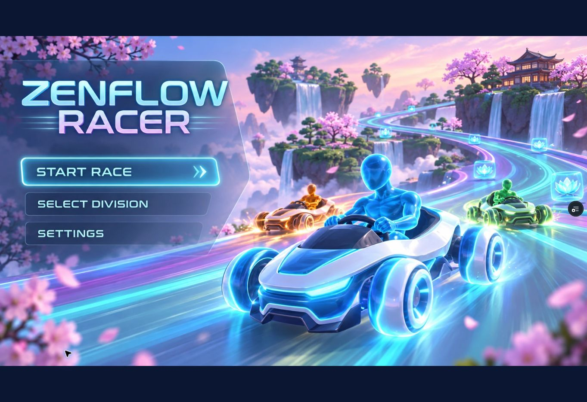
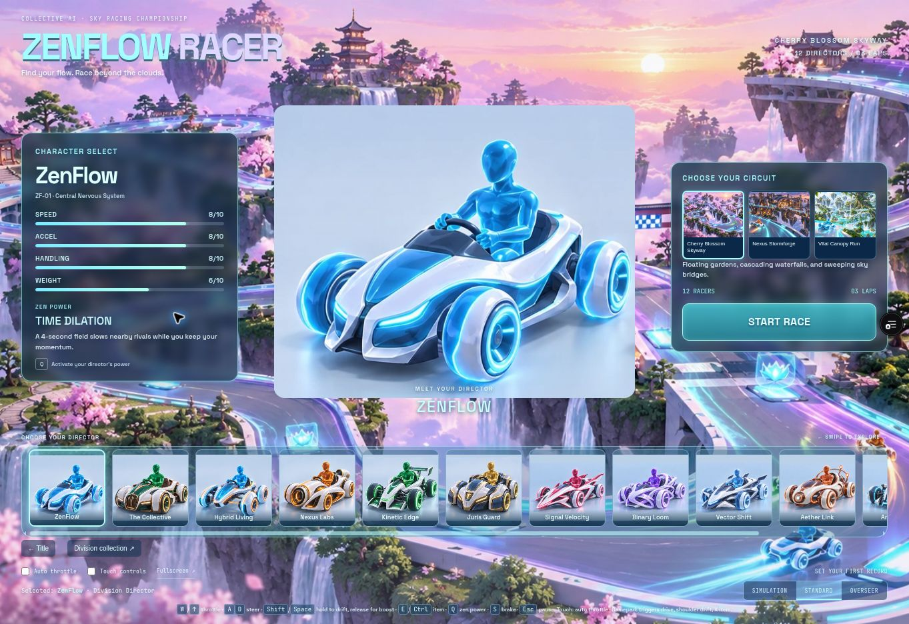

# Reference implementation review

## Scope and fidelity standard

This review covers the nine approved images: three circuit paintings, two six-kart sheets, one title screen, two six-power sheets, and one six-item sheet. The source game has twelve divisions, not the company's full twenty-division roster.

An embedded reference image can preserve the approved composition. A playable scene additionally requires geometry, materials, lighting, camera behavior, animation, collision and performance work. Merely embedding a concept painting in the menu does not establish that the playable scene matches it. Pixel-identical runtime fidelity is **not established** by this PR's automated checks.

## Reference acceptance matrix

| Reference | Required visual identity | Acceptance evidence needed |
| --- | --- | --- |
| Cherry Blossom Skyway | Pink blossom canopies, sculpted floating islands, pagodas, waterfalls, lavender sky and cyan elevated road | Actual in-game chase and overview captures |
| Nexus Stormforge | Large turbines, arched factory hangars, cranes, amber industrial lighting, floating cliffs | Actual in-game chase and overview captures |
| Vital Canopy Run | Giant living tree, glass biomes, white arches, lush vegetation, turquoise water and daylight | Actual in-game chase and overview captures |
| Kart sheet 1 | ZenFlow sculpted nose; Collective grille; Hybrid split nose; Nexus turbine; Kinetic open-wheel wing; Juris armor | All six runtime showroom silhouettes |
| Kart sheet 2 | Signal dart; Loom woven body; Vector aircraft fins; Aether orbital body; Animus mechanical drone; Helix organic ribs | All six runtime showroom silhouettes |
| Title screen | Approved title composition with functioning Start Race, Select Division and Settings controls | Desktop and mobile screenshots plus button interaction |
| Power sheet 1 | Clock dome, fortune coins, phase ghosts, hologram, green propulsion, golden shield facets | Runtime activation of all six powers |
| Power sheet 2 | Sonic rings, purple snare, portal step, coin orbit, sentinel drone, healing helix | Runtime activation of all six powers |
| Item sheet | Six individually recognizable devices with reference names and colors | HUD icons and projectile behavior |

## Integration review gates

- [x] Each of the three map selections changes the actual circuit and environment before racers spawn.
- [x] Track frames and world pickups reset correctly when changing maps.
- [x] Personal best records are separated by map, division and difficulty.
- [x] Kart factories preserve the animation and collision contracts used by the existing race simulation.
- [x] Power activation, cooldowns and defensive interactions remain covered by regression checks.
- [x] New runtime scripts, art and models are included in the production build and offline cache.
- [ ] Title controls work with pointer and keyboard; mobile layout remains usable.
- [ ] Race start, movement, pause, finish and rematch pass browser checks.
- [x] Evidence identifies the actual renderer; software fallback screenshots are not presented as WebGL fidelity proof.
- [x] Blender installation/export results are documented accurately.

## Review status

The coordinator independently reviewed the integration diff and ran `npm run verify` successfully after the empty item-art atlas was repaired. The release passes 35 gameplay/effects checks, offline shell checks for 24 entrypoint resources and 37 cached assets, and reference runtime geometry/resource checks.

The three closed circuits measure approximately 1,299 m, 1,318 m and 1,196 m, with 138, 219 and 232 world meshes respectively in the runtime geometry test. All twelve kart factories produce finite geometry and preserve required animation nodes. Kart export measured approximately 27,256–39,400 triangles and 24–30 meshes per kart. These are geometry counts, not device frame-rate measurements.

All nine approved PNGs are retained in `references/art/`; optimized WebP derivatives under `assets/art/` are used in the interface. Every derivative was decoded by the UI worker. An initially empty item atlas was found during independent review, regenerated and verified before release testing.

Blender 4.5 portable was installed, but its executable crashed in this environment. The runtime JSON exporter and Blender import script are included; no successful Blender-rendered result or authored `.blend`/GLB output is claimed.

## Remaining visual and verification gaps

- Pixel-identical playable maps, kart surfaces and animated powers are not established. The procedural runtime includes the reference landmarks and distinct signatures, but reference paintings contain richer surface, foliage and lighting detail.
- Embedded artwork preserves composition through optimized image derivatives; it is not an assertion that runtime geometry is identical to that artwork.
- The compatibility Canvas renderer remains simplified and does not reproduce the full WebGL assets.
- Browser screenshots, actual device frame timing, race completion/rematch and mobile touch interaction need to be assessed using the integration lead's final browser evidence. The coordinator's Node geometry tests do not substitute for these checks.
- Map switching updates sky, fog, lighting and recaptures the reflection cubemap in WebGL mode.

## Hosted preview checks

Vercel automatically built the PR branch successfully. Browser inspection confirmed the title controls, reference collection, circuit selectors, division selection, auto-throttle option, countdown, pause/resume and return to roster. Vital Canopy Run advanced to 104 km/h with the clock running; changing to Nexus Stormforge reset the race and selected the Hologram Decoy power. No game-origin browser errors were observed.

The browser explicitly reported `data-renderer="canvas"`; WebGL is unavailable in this cloud browser. These interactions verify the compatibility renderer and shared game simulation, **not** WebGL appearance or performance. Full race completion/rematch and physical mobile/gamepad checks remain unverified.

The compatibility showroom/portraits now display approved kart artwork, and each circuit has its matching scenic matte behind the live projected road. The interactive WebGL path continues using actual chassis and environment geometry.

### Captured browser evidence

Captured from Vercel preview of runtime commit `c3c1a74`. Both screenshots are explicitly from the Canvas compatibility browser, at 1363×936; they do not prove WebGL visual parity.

