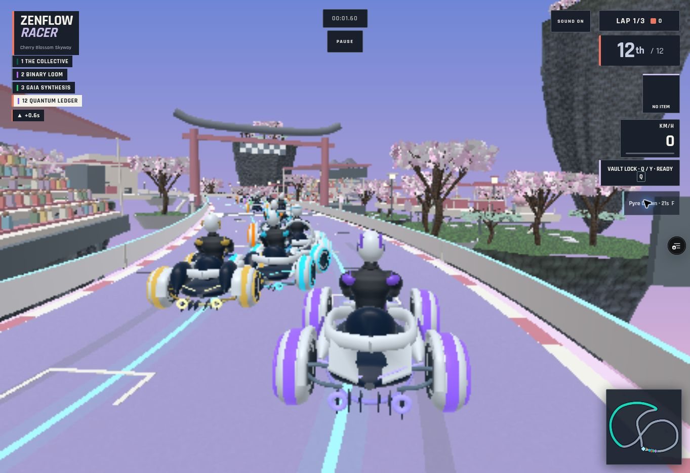
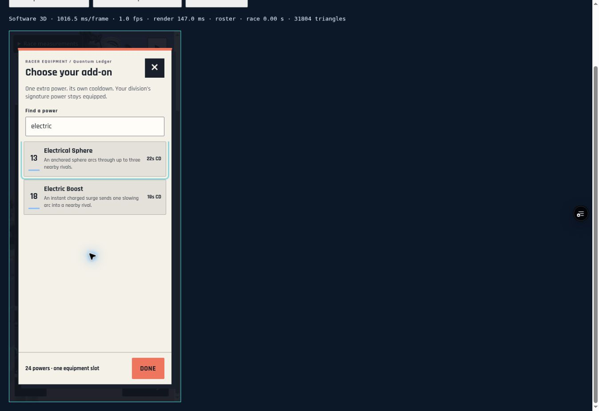
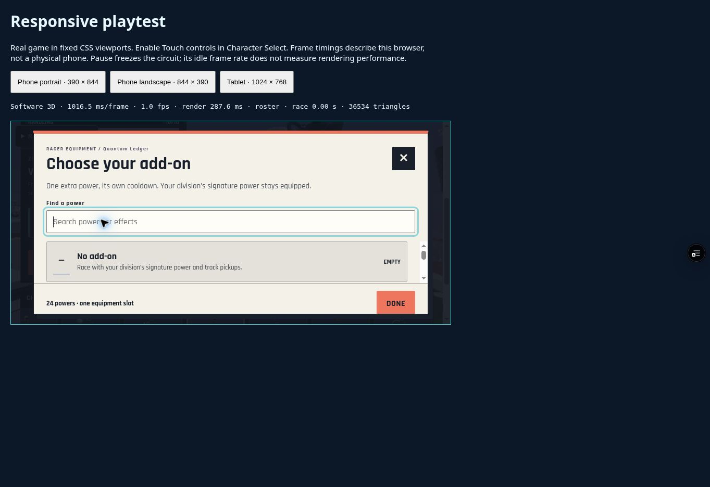
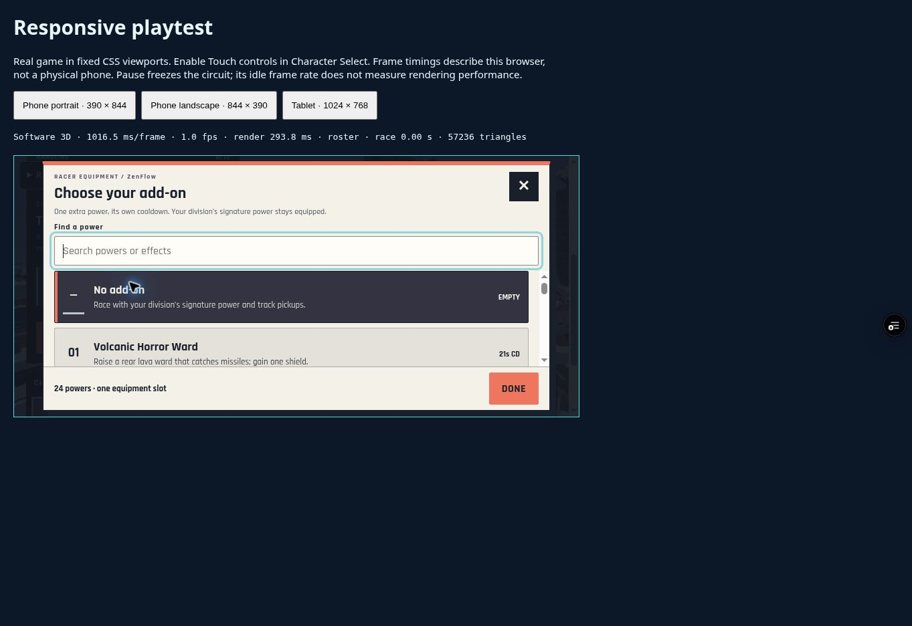

# Deployed browser checks

The browser smoke test used PR16 deployment `74a7e5f62d4c85f1d0bfb27421bddfb64e914a0b` after explicit user approval for temporary preview access. No game state was injected: interaction used the game's buttons, search field and keyboard events. Review viewports use the existing `responsive-review.html` page and its real game iframe.

| Check | Observed result |
|---|---|
| Title → character | All20 selectable racers; Quantum Ledger selected and its chassis rendered |
| Loadout | All24 unique powers plus No add-on present; Pyre search returns Pyre Crown |
| Equip and persist | Pyre Crown equipped on Ledger; still equipped after navigation into the responsive review page |
| Setup gate | Enter race disabled until an explicit circuit selection; Cherry Blossom selection enables it |
| Race | Twelve-racer grid; countdown proceeds into race; actual add-on button produces PYRE CROWN toast and21s cooldown |
| Pause | Race time00:01.70 and Pyre21s remained unchanged across successive observations while paused |
| Restart | Time resets to00:00.00, Ledger remains selected, Pyre returns to READY and is blocked during countdown |
| Keyboard | Tab from search focuses Electrical Sphere; Escape dismisses the dialog and returns focus to ADD-ON LOADOUT |
| Portrait390×844 | Search, matching cards and Done visible within the modal |
| Landscape844×390 | Initial footer clipping found; corrected deployment5bb3b30 retested, Done fully visible and closes the dialog |

## Screenshots

This captured frame shows the cooldown after activation. It does not show the full Pyre ring or prove contact with a rival. The pause assertions above come from the dialog and unchanged HUD text in successive DOM observations.

The after view uses deployment `5bb3b30a086e1383ed668a51b8cff9b9ff2af320`, which Vercel reports READY. Its source tree matches the local CSS correction. The fresh hostname has a separate save origin, so this view starts with ZenFlow and an empty slot.

## Verification limits

This browser reports `renderer=canvas` / Software3D. The review page recorded about1016ms per frame, while software render work varied by scene. This cloud cadence is not evidence of mobile hardware performance. No WebGL shader compilation or exhaustive screenshot review of all24 effects is claimed. The previously completed local mechanics, real Three.js/Anime.js object/timeline tests and Blender asset checks cover separate concerns.

GitHub Actions could not start because of the account's billing lock. `npm run verify` passed on the completed runtime; after the CSS correction, production build, add-on UI and release/offline tests passed again. Workflow requirements remain unchanged.
